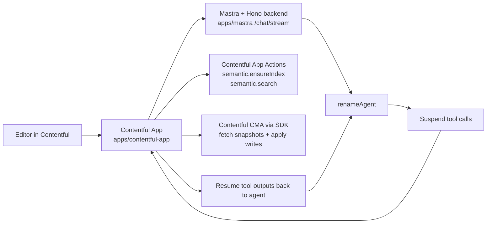

# Content Update Agent

Experimental monorepo for a Contentful rename assistant.

The current implementation helps an editor describe a product rename, search Contentful for likely references, draft field-level edits, review them in the app, and apply approved changes with the current user's Contentful permissions.

Repository naming is slightly ahead of the codebase naming: the GitHub repo is `content-agent-app-experimental`, while package names and much of the UI still use `contentful-rename` and `Product Rename Agent`.

## What is in this repo

- `apps/contentful-app`: React + Vite Contentful app. Hosts the chat UI, config screen, Contentful app locations, and Contentful App Actions used for semantic search.
- `apps/mastra`: Mastra agent plus a Hono server that streams chat responses and coordinates the multi-step rename flow.
- `packages/shared`: Shared Zod schemas, field type constants, and rich text helpers used by both app and backend.
- `packages/f36-ai-components`: Small local chat UI primitives used by the app.
- `AGENT_CHECKLIST.md`: Operational checklist for local setup, debugging, deployment, and handoff.

## Architecture



### Why the flow is split

The backend is responsible for conversation orchestration and proposal generation.

The frontend is responsible for Contentful reads and writes:

- candidate discovery resumes inside the app
- semantic search runs through Contentful App Actions when available
- entry snapshots are fetched through the current user's CMA session
- approved writes are applied through the current user's CMA session

That split keeps Contentful access user-scoped instead of giving the backend direct write access to content.

## End-to-end rename flow

1. The editor starts a chat from the `Page` location or optional `Agent` location.
2. The Mastra agent parses the rename request and builds a discovery plan.
3. The agent suspends `discoverCandidatesClient`.
4. The frontend resumes that step by:
   - optionally ensuring a semantic index exists
   - running semantic, keyword, or hybrid search
   - fetching candidate entry snapshots from Contentful
5. The agent drafts proposed changes from those snapshots.
6. The agent suspends `reviewProposalsClient`.
7. The editor approves, rejects, or edits proposed replacements in the app.
8. If approved changes exist, the agent suspends `applyApprovedChangesClient`.
9. The frontend applies those writes back to Contentful.

### Review and safety behavior

- `Approve all safe` only approves changes with no risk flags and confidence `>= 0.8`.
- Writes are grouped per entry and retried once if Contentful returns `VersionMismatch`.
- Result statuses are `APPLIED`, `SKIPPED`, `CONFLICT`, or `FAILED`.

### Supported content scanning

The app currently scans and patches these Contentful field types only:

- `Symbol`
- `Text`
- `RichText`

Rich text changes are applied at segment level using stored text-node paths.

## Repository layout

```text
.
|-- apps
|   |-- contentful-app
|   |   |-- functions/              # Contentful App Actions for semantic search/index checks
|   |   |-- scripts/                # live semantic search smoke test
|   |   `-- src/                    # Page, Config, Agent locations and chat UI
|   `-- mastra
|       |-- scripts/                # optional local HTTPS proxy helper
|       `-- src/                    # Hono server, Mastra agent, tools, heuristics
|-- packages
|   |-- shared                      # schemas, shared types, rich text helpers
|   `-- f36-ai-components           # local UI wrappers used by chat screens
|-- AGENT_CHECKLIST.md
`-- README.md
```

## Requirements

- Node.js 22 is the safest target because CI runs on Node 22
- npm workspaces (`packageManager` is `npm@10.9.2`)
- a Contentful app definition and installation
- a Contentful space/environment to test against
- an OpenAI API key if you want LLM-generated discovery plans and proposals

Without `OPENAI_API_KEY`, the backend falls back to deterministic heuristic query planning and proposal generation.

## Commands

| Command | What it does |
| --- | --- |
| `npm install` | Install all workspace dependencies |
| `npm run dev` | Starts only the Contentful frontend workspace |
| `npm run dev --workspace @contentful-rename/contentful-app` | Starts the Vite dev server for the app |
| `npm run dev --workspace @contentful-rename/mastra` | Starts the Mastra/Hono backend in watch mode |
| `npm run start --workspace @contentful-rename/mastra` | Starts the backend without watch mode |
| `npm run build` | Builds all workspaces that expose a build script |
| `npm run typecheck` | Type-checks all workspaces |
| `npm run lint` | Runs each workspace lint script; these are TypeScript checks today |
| `npm run test` | Runs all workspace tests |
| `npm run build --workspace @contentful-rename/contentful-app` | Builds the Contentful app bundle |
| `npm run upload --workspace @contentful-rename/contentful-app` | Uploads the built app bundle and functions with `contentful-app-scripts` |
| `npm run test:search:live --workspace @contentful-rename/contentful-app` | Runs a live semantic/keyword/hybrid smoke test against Contentful |

## Environment variables

Start from [`.env.example`](/Users/alexander.wood/Documents/Content Update Agent/.env.example). Some variables are only needed for local development, smoke tests, or advanced overrides.

Important runtime detail:

- `apps/contentful-app` uses Vite, so it reads `.env` automatically during local development
- `apps/mastra`, `apps/mastra/scripts/httpsProxy.mjs`, and the smoke test scripts use plain Node process env, so those variables must be exported in your shell before you run them

### Core variables

| Variable | Required | Used by | Notes |
| --- | --- | --- | --- |
| `OPENAI_API_KEY` | No | `apps/mastra` | If absent, discovery plans and proposals fall back to heuristics |
| `OPENAI_MODEL` | No | `apps/mastra` | Defaults to `gpt-5.4` |
| `MASTRA_USE_CLOUD_STORAGE` | No | `apps/mastra` | Set to `true` on Mastra Cloud when using Cloud-managed storage; skips custom `LibSQLStore` creation in app code |
| `MASTRA_STORAGE_URL` | No | `apps/mastra` | For BYO libSQL/Turso. If unset, local development falls back to `file:./.mastra/contentful-rename.db` |
| `MASTRA_STORAGE_AUTH_TOKEN` | No | `apps/mastra` | Preferred auth token for remote `libsql://` databases |
| `PORT` | No | `apps/mastra` | Backend port, default `4111` |
| `ALLOWED_ORIGIN` | No | `apps/mastra` | Recommended for deployed CORS; default behavior falls back to `*` if no origins are set |
| `ALLOWED_ORIGIN_EU` | No | `apps/mastra` | Recommended for `https://app.eu.contentful.com` |
| `VITE_PORT` | No | `apps/contentful-app` | Frontend dev/preview port, default `3000` |
| `VITE_DEV_SSL_KEY_PATH` | Yes for local frontend HTTPS | `apps/contentful-app`, `apps/mastra/scripts/httpsProxy.mjs` | Absolute path to local HTTPS key |
| `VITE_DEV_SSL_CERT_PATH` | Yes for local frontend HTTPS | `apps/contentful-app`, `apps/mastra/scripts/httpsProxy.mjs` | Absolute path to local HTTPS cert |
| `CONTENTFUL_ACCESS_TOKEN` | Yes for smoke tests and local function execution outside Contentful | app functions, smoke script | Management token fallback for semantic App Actions |
| `CONTENTFUL_APP_TOKEN` | No | app functions | Alternate token fallback for semantic App Actions |
| `CONTENTFUL_ORG_ID` | Yes for smoke tests and local function execution outside Contentful | app functions, smoke script | Contentful organization id |
| `CONTENTFUL_SPACE_ID` | Yes for smoke tests and local function execution outside Contentful | app functions, smoke script | Contentful space id |
| `CONTENTFUL_ENVIRONMENT_ID` | No | app functions, smoke script | Defaults to `master` |

### Optional test and infrastructure variables

| Variable | Used by | Notes |
| --- | --- | --- |
| `CONTENTFUL_LOCALE` | live smoke script | Defaults to `en-US` |
| `SEARCH_SMOKE_QUERY` | live smoke script | Defaults to `porter` |
| `HTTPS_PROXY_PORT` | `apps/mastra/scripts/httpsProxy.mjs` | Defaults to `4112` |
| `HTTPS_PROXY_TARGET_ORIGIN` | `apps/mastra/scripts/httpsProxy.mjs` | Defaults to `http://localhost:4111` |
| `TURSO_AUTH_TOKEN` | `apps/mastra` | Backward-compatible fallback auth token name for remote libSQL |
| `DATABASE_AUTH_TOKEN` | `apps/mastra` | Alternate fallback auth token name for remote libSQL |
| `CONTENTFUL_CMA_HOST` | app functions | Defaults to `https://api.contentful.com` |
| `CONTENTFUL_SEMANTIC_SETTINGS_URL` | app functions | Manual override for semantic settings endpoint |
| `CONTENTFUL_ENVIRONMENT_SEARCH_INDEX_URL` | app functions | Manual override for list-indices endpoint |
| `CONTENTFUL_CREATE_SEARCH_INDEX_URL` | app functions | Manual override for create-index endpoint |
| `CONTENTFUL_SEMANTIC_SEARCH_URL` | app functions | Manual override for semantic search endpoint |
| `CONTENTFUL_ENTRIES_URL` | app functions | Manual override for keyword search endpoint |

## Contentful app configuration

The app supports these locations:

- `Page`
- `App configuration`
- `Agent` (optional; uses the newer agent surface if available)

The app configuration screen stores these installation parameters:

| Parameter | Default | Purpose |
| --- | --- | --- |
| `mastraBaseUrl` | `https://your-mastra-project.example.com` | Backend base URL used for `/chat/stream` and `/health` |
| `allowedContentTypes` | `[]` | Optional allow-list for scanned content types |
| `maxDiscoveryQueries` | `5` | Discovery query cap, validated to `1-5` |
| `maxCandidatesPerRun` | `30` | Candidate cap, validated to `1-100` |
| `defaultDryRun` | `true` | Stored in config UI; not currently enforced by the runtime flow |
| `toolAvailability.semanticSearch` | `true` | Enables semantic/hybrid search. When disabled, the app forces keyword-only candidate discovery |

The chat UI also exposes richer debugging information during runs:

- structured error details with optional stack traces
- inline tool activity cards for tool inputs, outputs, and failures
- reasoning summaries and a right-rail execution trace when the model provides them

## Local development

### 1. Install dependencies

```bash
npm install
```

### 2. Prepare local HTTPS for the frontend

Contentful app iframes are loaded over HTTPS, so local frontend development should also use HTTPS.

1. Generate a localhost certificate, for example with `mkcert`.
2. Set these variables in `.env`:

```dotenv
VITE_PORT=3000
VITE_DEV_SSL_KEY_PATH=/absolute/path/to/localhost-key.pem
VITE_DEV_SSL_CERT_PATH=/absolute/path/to/localhost.pem
```

3. Start the frontend:

```bash
npm run dev --workspace @contentful-rename/contentful-app
```

4. Point the Contentful app frontend URL at `https://localhost:3000`.

The repo ignores `localhost*.pem`, `localhost*.crt`, and `localhost*.key`, so local certs should stay untracked.

### 3. Start the backend

Export backend variables into your shell first if you keep them in `.env`:

```bash
set -a; source .env; set +a
```

For local development, leave `MASTRA_USE_CLOUD_STORAGE` unset so the backend uses the local file database.

Then start the backend:

```bash
npm run dev --workspace @contentful-rename/mastra
```

The backend exposes:

- `GET /health`
- `POST /chat/stream`
- `POST /api/chat/stream`

### 4. Make the backend reachable from the app

You have two practical options.

#### Option A: use a public tunnel

Recommended when testing the full Contentful-hosted experience.

```bash
npx localtunnel --port 4111 --print-requests
```

Then set `mastraBaseUrl` in the app config screen to the generated `https://*.loca.lt` URL.

#### Option B: use the local HTTPS proxy helper

Useful when the browser running Contentful can reach your machine over `https://localhost`.

Make sure the HTTPS cert variables are exported in your shell before running it.

```bash
node apps/mastra/scripts/httpsProxy.mjs
```

This starts an HTTPS proxy on `https://localhost:4112` by default and forwards requests to `http://localhost:4111`.

### 5. Save app installation parameters in Contentful

In the `App configuration` location:

- set `mastraBaseUrl`
- optionally narrow `allowedContentTypes`
- adjust discovery and candidate limits if needed
- save the installation parameters

### 6. Test the rename flow

Example prompt:

```text
Rename "Acme Lite" to "Acme Core", search marketing pages first, and wait for approval before applying.
```

## Search behavior

The rename flow supports three search modes:

- `semantic`
- `keyword`
- `hybrid`

Behavior details from the current implementation:

- search query plans are capped at 5 queries
- semantic search is capped at 10 entries per query
- the exact old product name is forced into the query set if it was omitted
- if App Actions are unavailable in the current SDK context, the app falls back to CMA keyword search
- candidate snapshots are filtered to entries that still contain lexical variants of the old product name when possible

### Semantic search App Actions

The app bundle includes two Contentful App Actions:

- `semantic.ensureIndex`
- `semantic.search`

`semantic.ensureIndex` checks whether semantic search is supported for the locale and can create an index when missing.

`semantic.search` can run:

- semantic-only search
- keyword-only search
- hybrid search that merges semantic and keyword hits

## Proposal generation

Proposal drafting happens in the backend.

- If `OPENAI_API_KEY` is available, the backend uses `generateObject` with structured schemas for both discovery plans and proposed changes.
- If model calls fail, or if no API key is set, the backend falls back to deterministic heuristics.

Heuristic proposal generation currently:

- replaces lexical variants of the old product name
- creates field-level proposals for plain text fields
- creates segment-level proposals for rich text
- flags likely risky content such as legal copy, code-like text, or table-like content

Current risk flags are:

- `LEGAL_CONTEXT`
- `CODE_SNIPPET`
- `TABLE_CONTENT`
- `UNCERTAIN_VARIANT`
- `LIKELY_FALSE_POSITIVE`
- `MANUAL_REVIEW_REQUIRED`

## Testing and validation

### Workspace validation

```bash
npm run typecheck
npm run build
npm run test
```

### Targeted workspace checks

```bash
npm run test --workspace @contentful-rename/contentful-app
npm run typecheck --workspace @contentful-rename/contentful-app
npm run test --workspace @contentful-rename/mastra
```

### Live Contentful smoke test

With `CONTENTFUL_ACCESS_TOKEN`, `CONTENTFUL_ORG_ID`, and `CONTENTFUL_SPACE_ID` set:

```bash
set -a; source .env; set +a
```

```bash
npm run test:search:live --workspace @contentful-rename/contentful-app
```

The live smoke test:

- checks semantic index status for the target locale
- runs keyword search for `porter`
- runs hybrid search for `porter`
- runs semantic search for `porter`
- fails if keyword or hybrid return zero entries
- fails semantic only when the index is already `ACTIVE` and semantic still returns zero entries

Override the default query if needed:

```bash
SEARCH_SMOKE_QUERY=porter npm run test:search:live --workspace @contentful-rename/contentful-app
```

### CI

[`.github/workflows/ci.yml`](/Users/alexander.wood/Documents/Content Update Agent/.github/workflows/ci.yml) runs on pushes to `main` and on pull requests. It uses Node 22 and runs:

```bash
npm install
npm run typecheck
npm run build
npm run test
```

## Build and deploy

### Deployment notes

Treat this section as the source of truth for how releases are expected to work. If the deployment setup changes, update this section in the same change.

The deployment flow is split across two systems:

- Backend (`apps/mastra`)
  Expected to auto-deploy from git through Mastra Cloud after changes are pushed to the tracked branch/repo.
- Frontend + App Actions (`apps/contentful-app`)
  Deployed separately by uploading the built Contentful app bundle with `contentful-app-scripts`.

That means a full release that touches both sides usually has two steps:

1. Push the git commit so Mastra Cloud can deploy the backend update.
2. Upload and activate the new Contentful app bundle so the iframe UI and App Actions match the backend.

Before testing a change that touches backend behavior, confirm the Mastra Cloud deployment has completed and that the configured `mastraBaseUrl` points at that updated deployment.

### Storage modes

The backend supports two deployment storage modes:

- Mastra Cloud managed storage
  Set `MASTRA_USE_CLOUD_STORAGE=true` and enable `Store settings: Use Mastra Cloud's built-in LibSQLStore storage` in Mastra Cloud.
- BYO libSQL/Turso
  Set `MASTRA_STORAGE_URL` plus `MASTRA_STORAGE_AUTH_TOKEN` (or `TURSO_AUTH_TOKEN` / `DATABASE_AUTH_TOKEN`).

### Frontend bundle and App Actions

Build the Contentful app:

```bash
npm run build --workspace @contentful-rename/contentful-app
```

Upload the built bundle and function definitions:

```bash
npm run upload --workspace @contentful-rename/contentful-app
```

Implementation details worth knowing:

- Vite is configured with `base: "./"` so hosted Contentful bundles use relative asset paths
- the `functions/` directory is part of the uploaded app bundle
- after upload, activate the new bundle in Contentful before retesting

### Backend deployment

The expected production path is Mastra Cloud auto-deploy from git. Push the relevant commit/branch, wait for the cloud deployment to finish, and ensure it exposes `/health` plus `/chat/stream`.

If you are doing a manual or local backend deployment instead, deploy the server from `apps/mastra` with the required environment variables and expose `/health` plus `/chat/stream`.

The backend currently uses:

- Hono for HTTP routing
- Mastra for agent execution and memory
- local LibSQL file storage by default for development

#### Mastra Cloud managed storage

For the Mastra Cloud path:

1. In Mastra Cloud deployment settings, enable `Store settings: Use Mastra Cloud's built-in LibSQLStore storage`.
2. Add `MASTRA_USE_CLOUD_STORAGE=true` to the project environment variables.
3. Do not set BYO libSQL env vars unless you intentionally want to override Cloud-managed storage.

#### BYO libSQL/Turso

For a custom remote libSQL database:

```dotenv
MASTRA_STORAGE_URL=libsql://your-db.turso.io
MASTRA_STORAGE_AUTH_TOKEN=your-token
```

If `MASTRA_STORAGE_URL` starts with `libsql://` and no auth token is available, the backend now fails fast with a clear startup error.

## Troubleshooting

### Backend and tunnel failures

The frontend performs a backend preflight check when stream requests fail and surfaces specific guidance for common problems.

- `503 Tunnel Unavailable`
  Restart the tunnel and update `mastraBaseUrl` if the URL changed.
- `511 Network Authentication Required`
  Open the tunnel URL in a browser once or rotate to a new tunnel URL.
- `404 Not Found`
  `mastraBaseUrl` is pointing at a service that does not expose `/chat/stream`.
- timeout or fetch failure
  Verify the backend is running and `/health` is reachable.

### Search issues

- No semantic results with `UNSUPPORTED`
  The locale is not supported for semantic indexing in that organization.
- No results in narrow scans
  Check `allowedContentTypes` and make sure the old product name actually exists in supported field types.
- App Action API unavailable
  The app can still fall back to keyword search through CMA, but semantic and hybrid behavior will degrade.

### Apply issues

- `CONFLICT`
  Content changed during review. The app retries once on `VersionMismatch`, then reports a conflict.
- `FAILED`
  Check Contentful permissions, entry availability, locale availability, and field compatibility.

## Current constraints and implementation notes

- Root `npm run dev` starts only the frontend workspace, not the backend.
- The app supports `Page`, `App configuration`, and optional `Agent` locations only.
- Only `Symbol`, `Text`, and `RichText` fields are scanned and patched.
- Discovery queries are capped at 5 and per-query search hits are capped at 10.
- `defaultDryRun` is exposed in the config UI but is not currently used to gate apply behavior.
- `MASTRA_USE_CLOUD_STORAGE=true` overrides any cloud-injected storage URL and tells the app not to construct a custom `LibSQLStore`.
- The backend never writes directly to Contentful; writes happen in the frontend through the current user's SDK session.
- The chat UI stores a thread/resource id in `localStorage` per surface so conversations can resume within the same browser context.

## Related docs

- [AGENT_CHECKLIST.md](/Users/alexander.wood/Documents/Content Update Agent/AGENT_CHECKLIST.md)
